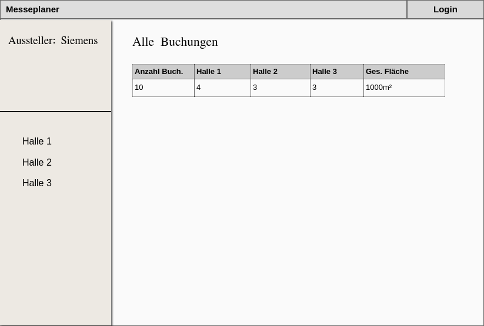

# Messeplaner (Praktikum 1 & 2)

---

## Einleitung: allgemeine Beschreibung der Aufgabenstellung

Bei dem Messeplaner handelt es sich um eine Webanwendung, in der kommende Messen, ihre Hallen und -belegungen von Aussenstehenden eingesehen und nach Ausstellern sortiert, von Ausstellern einzelne Standplätze gebucht oder storniert und von Mitarbeitern bearbeitet werden können.

---

## Nutzungsszenario: Messeveranstalter

### Allgemeine Beschreibung

Die Messeveranstalter oder Mitarbeiter sind eine der drei Gruppen in diesem Szenario.

### Beschreibung Persona

Die Intention des Messeveranstalters ist die, für kommende Messen jeweils Hallen zu planen, diese einzuteilen und alle bereits getätigten Buchungen zu bearbeiten.

### Interaktionsdesign

*Zustandsdiagramm Messeveranstalter/ -mitarbeiter*

Die Interaktion des Mitarbeiters beginnt, wenn er sich eingeloggt hat.
Wenn er sich eingeloggt hat, sieht er zu allererst die Übersicht aller Buchungen für die gesamte Messe.
Dabei besteht die Möglichkeit, einzelne Buchungen zu stornieren.
Eine weitere Möglichkeit der Interaktion ist die Einteilung der einzelnen Hallen für die Aussteller.

### Übersicht Interaktionen (Desktop)

#### Übersicht

*Übersicht aller Buchungen*

#### Hallenbearbeitung

*Bearbeitungsmöglichkeit einer Halle zum Bearbeiten*

### Übersicht Interaktionen (Mobile)

#### Übersicht

*Übersicht aller Buchungen*

#### Menu

*Ausgeklapptes Menu*

#### Hallenbearbeitung

*Bearbeitungsmöglichkeit einer Halle zum Bearbeiten*

---

## Nutzungsszenario: Aussteller

### Allgemeine Beschreibung

Der Aussteller ist ein registrierter Benutzer des Messeplanners. Er kann freie Flächen buchen, um dort seine Produkte und Leistungen zu präsentieren.

### Beschreibung Persona

### Interaktionsdesign

*Zustandsdiagramm Aussteller*

Nachdem sich der Aussteller eingeloggt hat, wird er auf eine neue Seite geleitet. Auf dieser Seite werden ihm seine bisherigen Buchungen angezeigt, die er bis dahin erstellt hat. Diese Seite dient lediglich als Übersicht. Möchte der Aussteller weitere Flächen buchen oder bereits erstellte Buchungen bearbeiten, so muss er zu der jeweiligen Hallenübersicht gehen.
In der Hallenübersicht werden gebuchte Flächen grün angezeigt. Flächen die nicht zur Auswahl stehen sind rot oder grau markiert. Der Aussteller kann freie oder gebuchte Flächen auswählen um nähere Informationen zu der Auswahl zu bekommen und entscheiden, ob er diese Fläche buchen bzw. stornieren möchte.

### Übersicht Interaktionen (Desktop)

#### Übersicht

*Übersicht der getätigten Buchungen*

#### Standbuchung

*Standbuchungsmöglichkeit pro Halle*

### Übersicht Interaktionen (Mobile)

#### Übersicht

*Übersicht der getätigten Buchungen*

#### Menu

*Ausgeklapptes Menu*

#### Standbuchung

*Standbuchungsmöglichkeit pro ausgewählter Halle*

---

## Nutzungsszenario: Besucher

### Allgemeine Beschreibung

Der Besucher ist kein registrierter Benutzer. Er kann auf die Hallenpläne zugreifen und kann nach Ausstellern suchen.

### Beschreibung Persona

### Interaktionsdesign

*Zustandsdiagramm Besucher*

Dem Besucher ist es möglich sich über die Angebote einer Messe einen Überblick zu machen. Er kann zwischen den verschiedenen Hallen navigieren und sich Detailinformationen zu einer ausgewählten Fläche anzeigen lassen. Außerdem kann der Besucher gezielt nach Ausstellern suchen. Wenn der gesuchte Aussteller eine Fläche gebucht hat, so wird diese farblich hervorgehoben.

### Übersicht Interaktionen (Desktop)

#### Übersicht + Suchen

*Übersicht der Halle mit eingebauter Suchfunktion*

#### Login

*Login-Seite, führt in Mitarbeiter-/ Ausstellerbereicht*

### Übersicht Interaktionen (Mobile)

#### Übersicht

*Übersicht der Halle / Homescreen*

#### Menu

*Ausgeklapptes Menu*

#### Suchen

*Suchen-Seite*

##### Ergebnis gefunden

*Suchen-Seite mit gefundenen Ergebnissen*

#### Login

*Login-Seite, führt in Mitarbeiter-/ Ausstellerbereicht*
